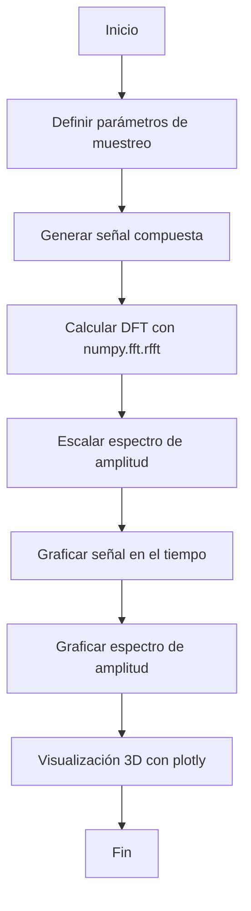
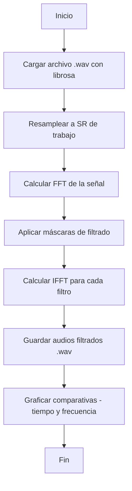

# TEL231 - Tarea 1

## Códigos Parte 3 y Parte 4

Este repositorio contiene los scripts en Python utilizados en la Tarea 1 del curso **TEL231 - Sistemas de Telecomunicaciones**.
Los códigos corresponden a la **Parte 3 (señal sintética y DFT)** y la **Parte 4 (procesamiento de audio con FFT y filtros)**.

---

## 👥 Integrantes

* **José Zaragoza** — ROL: 202073001-5 — [jose.zaragoza@usm.cl](mailto:jose.zaragoza@usm.cl)
* **Pascual Oteiza** — ROL: 202073002-3 — [pascual.oteiza@usm.cl](mailto:pascual.oteiza@usm.cl)

---

## 📦 Librerías necesarias

Instala los paquetes requeridos con:

```bash
pip install numpy scipy matplotlib plotly librosa soundfile pydub
```

Además:

* **FFmpeg** debe estar instalado y accesible para que `pydub` funcione correctamente.

  * En Windows:

    ```powershell
    winget install Gyan.FFmpeg
    ```
  * En Linux/macOS:

    ```bash
    sudo apt install ffmpeg
    # o
    brew install ffmpeg
    ```

---

## 📝 Explicación del código

### Parte 3 – Señal sintética y DFT (`Parte1.py`)

1. Se define un vector de tiempo de 0 a 2 segundos con frecuencia de muestreo de 1000 Hz.
2. Se genera una señal compuesta por 4 senoidales con distintas amplitudes y frecuencias.
3. Se aplica la **Transformada Discreta de Fourier (DFT)** con `numpy.fft.rfft`.
4. Se calcula la amplitud de un solo lado y se grafican:

   * Señal en el dominio del tiempo.
   * Espectro de amplitud.
   * Visualización 3D con `plotly` que combina tiempo, frecuencia y amplitud.

### Parte 4 – Procesamiento de audio (`Parte2.py`)

1. Se carga un archivo `.wav` con `librosa` y se ajusta la frecuencia de muestreo.
2. Se calcula la **FFT** de la señal.
3. Se aplican máscaras de filtrado ideales:

   * Pasa bajos (≤ 1000 Hz)
   * Pasa banda (300 – 3400 Hz)
   * Pasa altos (≥ 1000 Hz)
4. Se reconstruyen las señales filtradas mediante IFFT y se guardan como `.wav`.
5. Se generan gráficas comparativas en el dominio temporal y espectral.

---

## 📊 Diagramas de flujo

### Parte 3 (`Parte1.py`)



### Parte 4 (`Parte2.py`)


---

## ▶️ Ejecución

### Parte 3

```bash
cd src
python Parte1.py
```

Resultados: imágenes en `../imagenes/`.

### Parte 4

```bash
cd src
python Parte2.py
```

Resultados: audios en `../audios/audios_filtrados/` y gráficas en `../imagenes/`.
